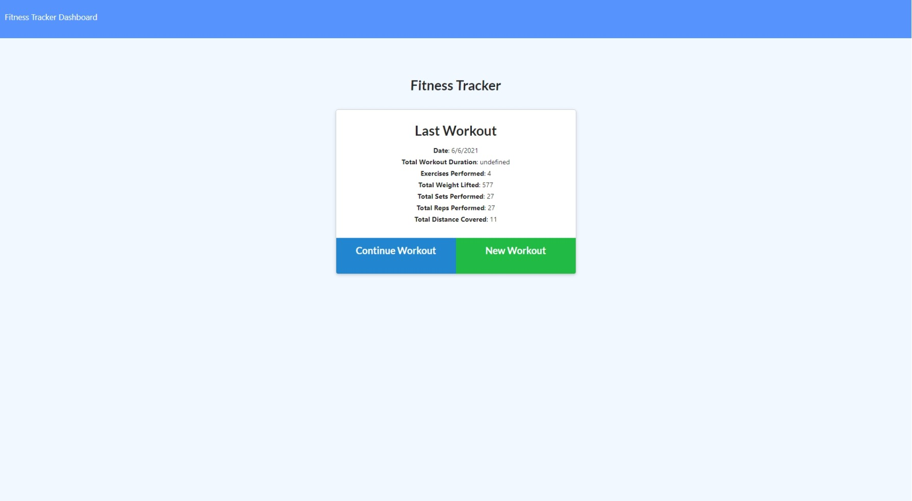
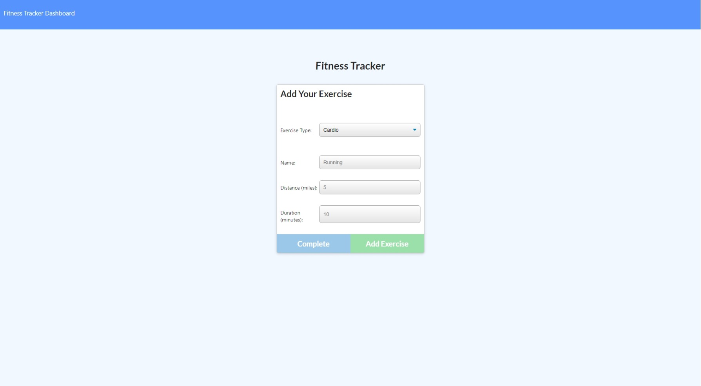
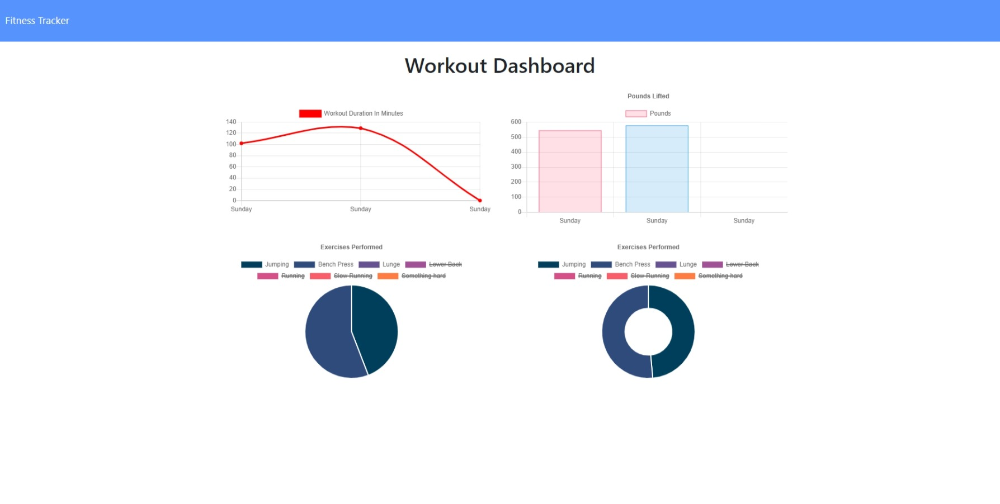

# workout_tracker

#### Table of Contents
* [About](#about-this-project)
    * [Description](#description)
    * [Built With](#built-with)
* [Usage](#usage)
* [Contributors](#contributors)

# About this Project

## Description

This is a simple workout tracker that I built the back-end for. You can create a workout and add exersizes to it, and complete when you have added what you want. You can create a new workout or add to the most recent one. There is also a stats page that displays your workout statistics (pounds, reps, time, etc.). 

# Usage

Click the link to our webpage: <https://thawing-journey-42255.herokuapp.com/>

# Contributors

* [Samuel Oberg](https://github.com/sosoberg)
